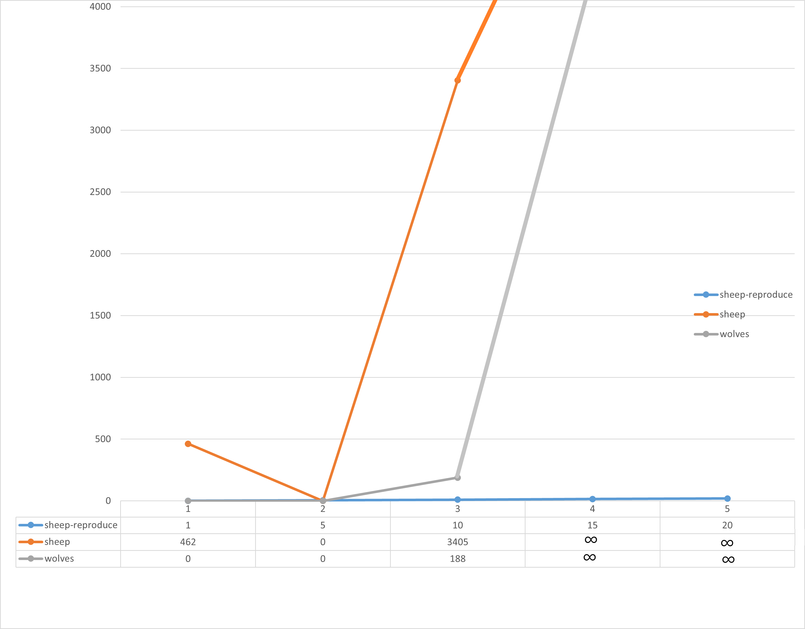
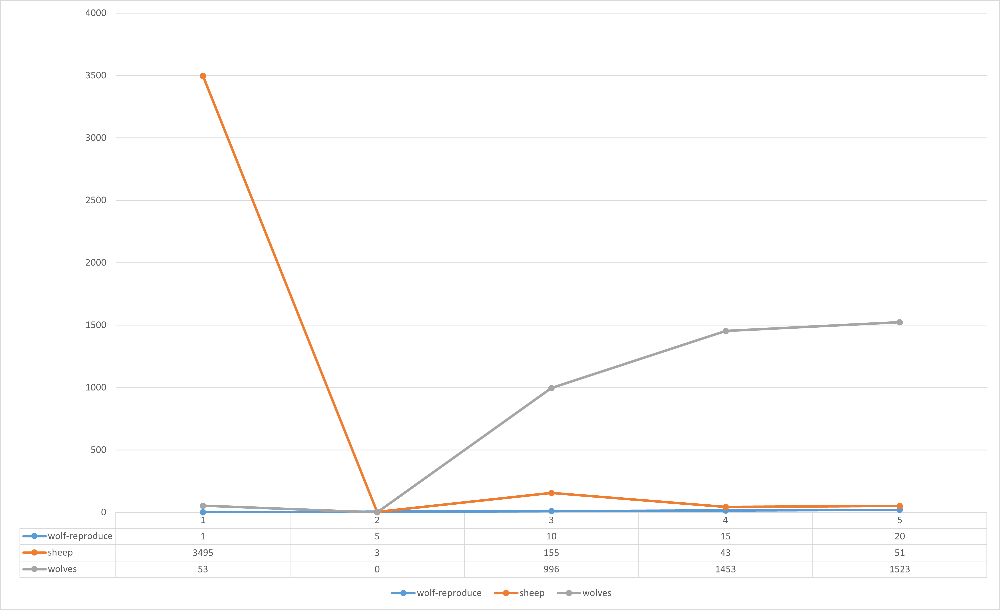
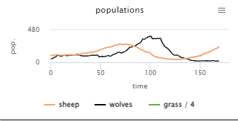
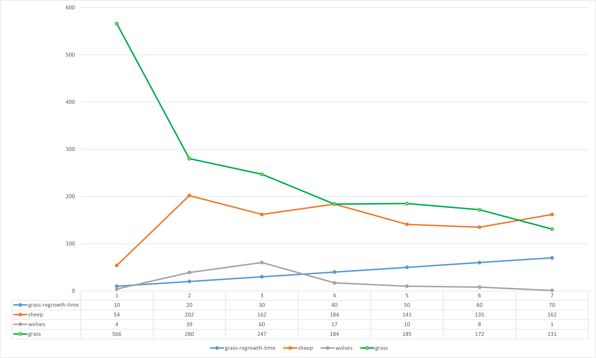

## Комп'ютерні системи імітаційного моделювання
## СПм-22-6, Гунько Михайло Андрійович
### Лабораторна робота №**1**. Опис імітаційних моделей та проведення обчислювальних експериментів

 

### Варіант 7, Wolf Sheep Predation. Модель взаємоіснування хижаків та їх жертв. Модель у середовищі NetLogo:
[Wolf Sheep Predation](http://www.netlogoweb.org/launch#http://www.netlogoweb.org/assets/modelslib/Sample%20Models/Biology/Wolf%20Sheep%20Predation.nlogo)

 

## Вербальний опис моделі:
Ця модель досліджує стабільність екосистем хижак-жертва. Така система називається нестабільною, якщо вона має тенденцію призводити до вимирання одного або кількох видів. Навпаки, система є стабільною, якщо вона прагне підтримувати себе протягом тривалого часу, незважаючи на коливання чисельності населення.
### Є два основних варіанти цієї моделі:

У першому варіанті, версії «вівці-вовки», вовки та вівці безладно блукають по ландшафту, а вовки шукають овець, на яких можна поласувати. Кожен крок коштує вовкам енергії, і вони повинні їсти овець, щоб відновити свою енергію - коли у них закінчується енергія, вони гинуть. Щоб забезпечити збереження популяції, кожен вовк чи вівця мають фіксовану ймовірність відтворення на кожному кроці часу. У цьому варіанті ми моделюємо траву як «нескінченну», щоб вівці завжди мали достатньо їжі, і ми явно не моделюємо поїдання або вирощування трави. Таким чином, вівці не отримують і не втрачають енергію під час їжі чи руху. Ця варіація створює цікаву динаміку популяції, але в кінцевому підсумку нестабільна. Цей варіант моделі особливо добре підходить для взаємодіючих видів у багатому живильному середовищі, наприклад, двох штамів бактерій у чашці Петрі.

Другий варіант, версія «вівці-вовки-трава», явно моделює траву (зелену) на додаток до вовків і овець. Поведінка вовків ідентична першому варіанту, але цього разу вівці повинні їсти траву, щоб зберегти свою енергію - коли вони закінчуються, вони гинуть. Після того, як траву з’їли, вона відростає лише через певний проміжок часу. Ця варіація складніша за першу, але загалом стабільна. Це ближче до класичних моделей коливань населення Лотки Вольтерра. Хоча класичні моделі LV припускають, що популяції можуть приймати реальні значення, але в невеликих популяціях ці моделі недооцінюють вимирання, а моделі на основі агентів, такі як наведені тут, дають більш реалістичні результати.

### Керуючі параметри:
- **model-version** - вибір версії моделі.
- **initial-number-sheep** - початкова кількість овець.
- **initial-number-wolves** - початкова кількість вовків.
- **grass-regrowth-time** - скільки часу потрібно, щоб трава відростала після того, як її з’їли.
- **sheep-gain-from-food** - Кількість енергії, яку вівці отримують за кожну з’їдену травинку.
- **wolf-gain-from-food** - кількість енергії, яку вовки отримують за кожну з’їдену вівцю.
- **sheep-reproduce** - ймовірність вівця розмножується на кожному кроці часу.
- **wolf-reproduce** - ймовірність розмноження вовка на кожному кроці часу.

### Параметри візуалізації:
- **show-energy** - показувати чи ні енергію кожної тварини як число?

### Показники роботи системи:
- **sheep** - поточна кількість овець.
- **wolves** - поточна кількість вовків.
- **grass** - поточна кількість трави.
- **populations** - графік, що відображує значення параметрів **sheep**, **wolves** та **grass**.

### Недоліки моделі:
- Відсутність зграйності вовків для оточення стада овець як у реальному житті.
- Вівці рухаються випадково і не намагаються втекти від вовків.

### Примітки:
- При стандартних налаштуваннях моделі найчастіше вовки з'їдають більшість овець та вмирають з голоду, після чого вівці безперешкодно розмножуються за захоплюють світ. Коли вівці остаточно захоплюють світ - відображається відповідне повідомлення.
- Під час роботи модель споживає багато ресурсів ЕОМ.
  
 

## Обчислювальні експерименти

### 1. Вплив розмножуваності овець на показники системи
Досліджується залежність **sheep** та **wolves** від **sheep-reproduce** протягом певної кількості тактів (200).
Усього 5 симуляцій. Керуючі параметри мають такі значення:
- **model-version** - sheep-wolves
- **initial-number-sheep** - 100
- **initial-number-wolves** - 50
- **grass-regrowth-time** - 0
- **sheep-gain-from-food** - 0
- **wolf-gain-from-food** - 20
- **wolf-reproduce** - 5

<table>
<thead>
<tr><th>sheep-reproduce</th><th>sheep</th><th>wolves</th></tr>
</thead>
<tbody>
<tr><td>1</td><td>462</td><td>0</td></tr>
<tr><td>5</td><td>0</td><td>0</td></tr>
<tr><td>10</td><td>3405</td><td>188</td></tr>
<tr><td>15</td><td>∞</td><td>∞</td></tr>
<tr><td>20</td><td>∞</td><td>∞</td></tr>
</tbody>
</table>

Під час проводження експерименту при **sheep-reproduce** >10 жоден з агентів так і не зник з робочого простору симуляції. Окрім того навантаження на систему було надпотужне.

 

### 2. Вплив розмножуваності вовків на показники системи
Досліджується залежність **sheep** та **wolves** від **wolf-reproduce** протягом певної кількості тактів (200).
Усього 5 симуляцій. Керуючі параметри мають такі значення:
- **model-version** - sheep-wolves
- **initial-number-sheep** - 100
- **initial-number-wolves** - 50
- **grass-regrowth-time** - 0
- **sheep-gain-from-food** - 0
- **wolf-gain-from-food** - 20
- **sheep-reproduce** - 5

<table>
<thead>
<tr><th>sheep-reproduce</th><th>sheep</th><th>wolves</th></tr>
</thead>
<tbody>
<tr><td>1</td><td>3495</td><td>53</td></tr>
<tr><td>5</td><td>3</td><td>0</td></tr>
<tr><td>10</td><td>15</td><td>996</td></tr>
<tr><td>15</td><td>43</td><td>1453</td></tr>
<tr><td>20</td><td>51</td><td>1523</td></tr>
</tbody>
</table>

Під час цього експерименту було помічено дуже різні результати, але якщо підвести підсумки, то при **wolf-reproduce** <10 вовки з'їдаючи забагато овець не встигали давати нащадок та вимирали. Але при підвищенні шансу не було помічено вимирання будь-якого типу агентів, але графік почав виглядати таким чином:

 

### 3. Вплив швидкості вирастання трави на показники системи
Досліджується залежність **sheep**, **wolves** та **grass** від **grass-regrowth-time** протягом певної кількості тактів (200).
Усього 5 симуляцій. Керуючі параметри мають такі значення:
- **model-version** - sheep-wolves
- **initial-number-sheep** - 100
- **initial-number-wolves** - 50
- **sheep-gain-from-food** - 4
- **wolf-gain-from-food** - 20
- **sheep-reproduce** - 4
- **wolf-reproduce** - 5

<table>
<thead>
<tr><th>grass-regrowth-time</th><th>sheep</th><th>wolves</th><th>grass</th></tr>
</thead>
<tbody>
<tr><td>10</td><td>54</td><td>4</td><td>566</td></tr>
<tr><td>20</td><td>202</td><td>39</td><td>280</td></tr>
<tr><td>30</td><td>162</td><td>60</td><td>247</td></tr>
<tr><td>40</td><td>184</td><td>17</td><td>184</td></tr>
<tr><td>50</td><td>141</td><td>10</td><td>185</td></tr>
<tr><td>60</td><td>135</td><td>8</td><td>172</td></tr>
<tr><td>70</td><td>162</td><td>1</td><td>131</td></tr>
</tbody>
</table>

Під час проведення експерименту було відзначено, що будь яке значення **grass-regrowth-time** окрім 0 не настільки впливає на процес симуляції, щоб це було можливо помітити.
